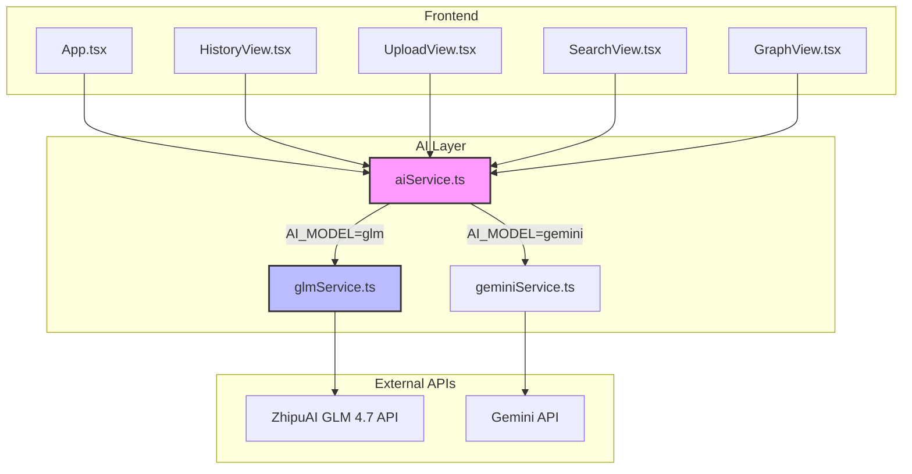

# Phase 2: GLM Integration - Implementation Plan

## Overview

Replace Gemini with ZhipuAI GLM 4.7 for all AI features. The foundation is already in place, but there are critical issues that need to be fixed.

## Current State Analysis

### Already Implemented ✅

| Component | File | Status |
|-----------|------|--------|
| GLM Service | [`src/services/glmService.ts`](src/services/glmService.ts) | Complete with all functions |
| AI Service Abstraction | [`src/services/aiService.ts`](src/services/aiService.ts) | Service selector working |
| Environment Config | [`.env`](.env) | GLM configured as primary |
| Model Selector UI | [`src/components/AIModelSelector.tsx`](src/components/AIModelSelector.tsx) | UI for switching models |

### Critical Issues ❌

1. **Direct Gemini imports bypass the abstraction layer:**
   - [`src/App.tsx:11`](src/App.tsx:11) - imports `getEmbedding` from geminiService
   - [`src/components/HistoryView.tsx:2`](src/components/HistoryView.tsx:2) - imports `generatePatientExecutiveSummary` from geminiService

2. **Missing rate limiting** - No exponential backoff for 429 errors

3. **Incomplete error handling** - Basic error handling exists but needs improvement

## Requirements Mapping

| Requirement | Description | Status |
|-------------|-------------|--------|
| GLM-01 | Configure ZhipuAI API endpoint | ✅ Done |
| GLM-02 | Implement chat completions for transcript analysis | ✅ Done |
| GLM-03 | Implement embedding generation | ✅ Done |
| GLM-04 | Add rate limiting with exponential backoff | ❌ Not Done |
| GLM-05 | Robust error handling with retry logic | ⚠️ Partial |

## Implementation Tasks

### Task 1: Fix Direct Gemini Imports

**Files to modify:**
- [`src/App.tsx`](src/App.tsx) - Change line 11
- [`src/components/HistoryView.tsx`](src/components/HistoryView.tsx) - Change line 2

**Changes:**
```typescript
// Before (App.tsx)
import { getEmbedding } from './services/geminiService';

// After
import { getEmbedding } from './services/aiService';

// Before (HistoryView.tsx)
import { generatePatientExecutiveSummary } from '../services/geminiService';

// After
import { generatePatientExecutiveSummary } from '../services/aiService';
```

### Task 2: Add Rate Limiting with Exponential Backoff

**File to modify:** [`src/services/glmService.ts`](src/services/glmService.ts)

**Implementation:**
```typescript
// Rate limiting configuration
const RATE_LIMIT_CONFIG = {
  maxRetries: 3,
  initialDelayMs: 1000,
  maxDelayMs: 10000,
  backoffMultiplier: 2
};

async function withRetry<T>(
  operation: () => Promise<T>,
  operationName: string
): Promise<T> {
  let lastError: Error | null = null;
  let delay = RATE_LIMIT_CONFIG.initialDelayMs;

  for (let attempt = 0; attempt < RATE_LIMIT_CONFIG.maxRetries; attempt++) {
    try {
      return await operation();
    } catch (error: any) {
      lastError = error;
      
      // Check if it's a rate limit error
      if (error.status === 429 || error.message?.includes('429')) {
        console.warn(`[GLM] Rate limited on ${operationName}, attempt ${attempt + 1}`);
        await new Promise(resolve => setTimeout(resolve, delay));
        delay = Math.min(delay * RATE_LIMIT_CONFIG.backoffMultiplier, RATE_LIMIT_CONFIG.maxDelayMs);
        continue;
      }
      
      throw error;
    }
  }

  throw lastError || new Error(`Rate limit exceeded for ${operationName}`);
}
```

### Task 3: Improve Error Handling

**File to modify:** [`src/services/glmService.ts`](src/services/glmService.ts)

**Add user-friendly error messages:**
```typescript
const ERROR_MESSAGES: Record<string, string> = {
  '401': 'API key is invalid. Please check your GLM_API_KEY environment variable.',
  '429': 'Rate limit exceeded. Please wait a moment and try again.',
  '500': 'GLM service is temporarily unavailable. Please try again later.',
  'network': 'Network error. Please check your internet connection.',
  'timeout': 'Request timed out. Please try again.',
  'default': 'An unexpected error occurred. Please try again.'
};

function getUserFriendlyError(error: any): string {
  if (error.status) {
    return ERROR_MESSAGES[String(error.status)] || ERROR_MESSAGES.default;
  }
  if (error.message?.includes('network') || error.message?.includes('fetch')) {
    return ERROR_MESSAGES.network;
  }
  return ERROR_MESSAGES.default;
}
```

### Task 4: Add searchPubMed for GLM

**File to modify:** [`src/services/glmService.ts`](src/services/glmService.ts)

Currently `aiService.ts` falls back to Gemini for `searchPubMed`. Need to implement GLM version:

```typescript
export const searchPubMedGLM = async (clinicalFeatures: string, language: Language) => {
  const langText = language === 'es' ? 'Spanish' : 'English';
  
  const messages = [
    {
      role: "system",
      content: `You are a veterinary research assistant. Provide information about veterinary medical literature related to clinical features. Include prognosis, treatment options, and similar case studies. Respond in ${langText}.`
    },
    {
      role: "user",
      content: `Search for veterinary medical literature related to: ${clinicalFeatures}. Focus on prognosis, treatment options, and similar case studies. Provide a summary and list potential sources.`
    }
  ];

  const result = await callGLMAPI(messages, false);
  
  return {
    text: result,
    sources: [] // GLM doesn't have built-in search like Gemini
  };
};
```

### Task 5: Update Environment Documentation

**Files to update:**
- [`.env.docker.example`](.env.docker.example) - Ensure GLM vars are documented
- [`secrets.env.example`](secrets.env.example) - Ensure GLM vars are documented

## Testing Plan

1. **Unit Tests:**
   - Test rate limiting with mock 429 responses
   - Test error handling with various error codes
   - Test retry logic

2. **Integration Tests:**
   - Test full consultation flow with GLM
   - Test embedding generation
   - Test semantic search
   - Test graph Q&A

3. **Manual Testing:**
   - Upload audio and verify transcription
   - Search consultations
   - View patient graph
   - Generate executive summary

## Success Criteria

- [ ] No direct Gemini imports remain in the codebase
- [ ] Rate limiting with exponential backoff implemented
- [ ] User-friendly error messages displayed for all API failures
- [ ] All AI features work with GLM as primary model
- [ ] searchPubMed works with GLM (without Google Search grounding)
- [ ] Environment documentation updated

## Architecture Diagram



## Dependencies

- No new npm packages required
- Uses existing fetch API for HTTP requests

## Risks and Mitigations

| Risk | Mitigation |
|------|------------|
| GLM API changes | Use stable API version, implement fallback |
| Rate limits hit frequently | Implement aggressive caching, add user warnings |
| Audio transcription quality | GLM may not support audio directly - may need separate STT |

## Notes

- GLM uses Anthropic-compatible endpoint at `https://api.z.ai/api/anthropic`
- Embedding endpoint is separate: `https://api.z.ai/api/v1/embeddings`
- The current implementation tries multiple model versions (glm-4.7, glm-4.6, etc.) for resilience
